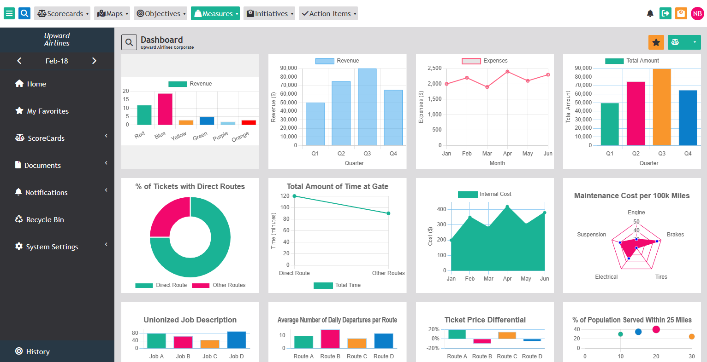

[Click Here To View Project](https://upward-airlines-corporate-dashboard.netlify.app/)
  
## Tools
- **HTML**
- **CSS**
- **JAVASCRIPT**
- **Font Awesome**
- **ChartJs**
- **VScode**

  
 A responsive and interactive dashboard for Upward Airlines, providing a comprehensive overview of key metrics, scorecards, documents, notifications, and system settings.

This HTML code represents a dashboard interface for an airline company called Upward Airlines. The dashboard includes a navbar at the top with various menu options and icons for quick actions. It also contains a side menu for navigation and a main content section displaying charts and data columns.

The code includes the necessary HTML structure, CSS stylesheets, and JavaScript files to create the interactive and visually appealing dashboard. It utilizes font icons from Font Awesome and Chart.js library for chart rendering.

The dashboard offers functionality such as search, favorites, scorecards, documents, notifications, system settings, history, and more. It provides a user-friendly interface for administrators to manage and monitor various aspects of the airline's performance.

Overall, the Upward Airlines Dashboard offers a sleek and intuitive interface to access and analyze crucial data and metrics related to the airline's operations, performance, and key performance indicators.